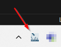
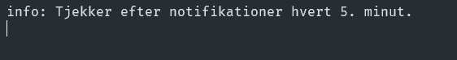
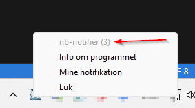
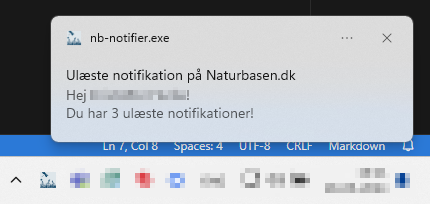

# nb-notifier
Få besked om ulæste notifikation på naturbasen.dk som en notifikation på dit skrivebord.

## Byg af kode
Koden er skrevet i programmeringssproget [Zig](https://ziglang.org/), specifikt version 0.11.0.

Projektet benytter `git submodules` s husk `--recurse-submodules` nÂr du kloner eller hent dem efterf¯lgende med `git submodule update --recursive --init`.

## Download af program
Hvis man ikke selv kan eller vil bygge programmet ligger der et bygget program under [Releases](https://github.com/svc-user/nb-notifier/releases).

## Opsætning
For at programmet kan tjekke notifikationer skal du angive brugernavn og kodeord. 

Læg en kopi af `creds.json.template` i samme mappe som `nb-notifier.exe` og omdøb den til `creds.json`. 

Udfyld den med din brugerinfo.

## Brug af programmet
Når programmet er startet får du et lille "Naturbasen" ikon i dit notifikationsområde. Samtidig får du et terminalvindue med teksten "Tjekker efter notifikationer hvert 5. minut.".

---

Klikker man med musen på ikonet åbner en lille menu. 

Her kan man se (i parantes) hvor mange ulæste notifikater man har, samt klikke sig ind på GitHub (Info om programmet), Notifikationssiden på Naturbasen (Mine notifikationer) eller lukke programmet (Luk).

---

Når det så sker, at der er kommet flere ulæste notifikationer på Naturbasen end ved sidste tjek kommer en popup i windows med besked om hvor mange ulæste notifikationer der er. 

Man kan klikke på popup-en for at åbne Naturbasen direkte i browseren.

